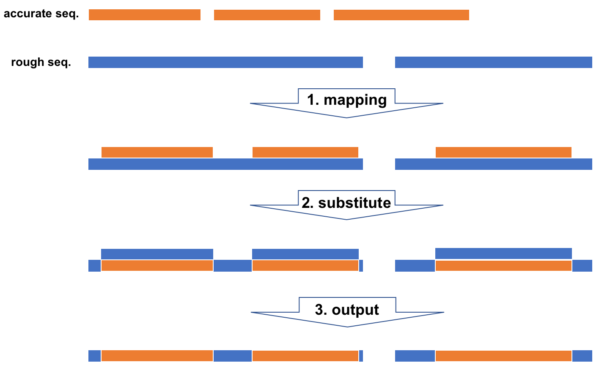

# get substituted sequences

## Usage
```
$ substitute.py -r rough_sequences.fasta -a accurate_sequences.fasta -o <output_dir>
```
- accurate_sequences.fasta; MiSeq由来contigsなどの高quality配列
- rough_sequences.fasta; Nanopore由来contigsなどの低quality配列

## 検証
置換前と置換後の2配列をアライメントした結果を可視化する(追記予定)
